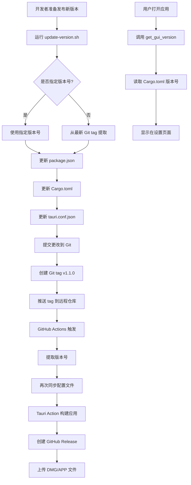

# 版本管理系统实现总结

## 📋 需求回顾

用户希望实现一个统一的版本管理机制，满足以下要求：
1. ✅ Git tag 作为唯一真实来源（打什么标签，打包出来的就是什么版本）
2. ✅ 应用内部显示的版本号与 Git tag 一致
3. ✅ 不要硬编码版本号，所有版本信息自动同步

## ✅ 实现方案

### 1. 核心组件

#### 📜 版本同步脚本 (`scripts/update-version.sh`)

**功能**：
- 从 Git tag 或命令行参数提取版本号
- 自动更新三个配置文件中的版本号：
  - `package.json` (前端)
  - `tauri-gui/Cargo.toml` (后端)
  - `tauri-gui/tauri.conf.json` (Tauri 配置)
- 验证版本号格式（语义化版本 x.y.z）
- 提供下一步操作提示

**使用方式**：
```bash
# 指定版本号
./scripts/update-version.sh 1.1.0

# 从最新 Git tag 自动提取
./scripts/update-version.sh
```

#### 🔧 GitHub Actions 工作流 (`.github/workflows/release.yml`)

**新增步骤**：
1. **Extract version from Git tag**：从 `GITHUB_REF` 提取 tag 并去掉 `v` 前缀
2. **Update version in config files**：运行 `update-version.sh` 同步配置文件
3. **Build and Publish**：使用提取的 tag 创建 Release

**触发条件**：推送 `v*` 格式的 tag

####  后端命令 (`tauri-gui/src/commands/mod.rs`)

**新增数据结构**：
```rust
/// Mole GUI 版本信息（应用自身的版本）
#[derive(Serialize)]
pub struct GuiVersionInfo {
    /// GUI 应用的版本号（从 Cargo.toml 中读取）
    pub version: String,
}
```

**新增命令**：
```rust
#[tauri::command]
pub async fn get_gui_version() -> Result<GuiVersionInfo, String> {
    // env!("CARGO_PKG_VERSION") 是 Rust 编译时宏
    // 会在编译时将 Cargo.toml 中的 version 字段展开为字符串字面量
    Ok(GuiVersionInfo {
        version: env!("CARGO_PKG_VERSION").to_string(),
    })
}
```

**注册位置**：`tauri-gui/src/lib.rs` 的 `invoke_handler![]` 宏中

#### ️ 前端集成 (`src/pages/SettingsPage.tsx`)

**新增状态**：
```typescript
const [guiVersion, setGuiVersion] = useState<string>("");
```

**加载逻辑**：
```typescript
const loadGuiVersion = useCallback(async () => {
  try {
    const versionInfo = await invoke<GuiVersionInfo>("get_gui_version");
    setGuiVersion(versionInfo.version);
  } catch (err) {
    console.error("Failed to load GUI version:", err);
  }
}, []);
```

**显示位置**：设置页面的 "About" 区域
```tsx
<span className="text-surface-200">
  {guiVersion ? `v${guiVersion}` : t("common.loading")}
</span>
```

### 2. 工作流程



### 3. 数据流向

```
Git Tag (v1.1.0)
    ↓
update-version.sh 脚本
    ↓
┌─────────────────┬──────────────────┬────────────────────
│ package.json    │ Cargo.toml       │ tauri.conf.json    │
│ version: 1.1.0  │ version = "1.1.0"│ version: "1.1.0"   │
└─────────────────┴──────────────────┴────────────────────┘
    ↓                    ↓
    │              Rust 编译时
    │              env!("CARGO_PKG_VERSION")
    │                    ↓
    │              get_gui_version() 命令
    │                    ↓
    ──────────────→ 前端 SettingsPage 显示 v1.1.0
    
同时：
GitHub Actions 提取 tag → 创建 Release "Mole v1.1.0"
                          → 构建产物 "Mole_1.1.0_aarch64.dmg"
```

## 🎯 关键优势

### 1. 单一真实来源
- **Git tag 是唯一权威**：所有版本号都从这里派生
- **消除不一致**：不会出现文件名、内部版本、Release 名称不同的情况

### 2. 自动化程度高
- **本地开发**：一行命令同步所有配置
- **CI/CD**：推送 tag 后全自动构建和发布
- **零人工干预**：无需手动修改多个文件

### 3. 可追溯性强
- **Git 历史清晰**：每次版本变更都有明确的 commit
- **易于回滚**：可以删除 tag 重新发布
- **审计友好**：所有版本变化都可追踪

### 4. 灵活性好
- **支持预发布版本**：如 `v2.0.0-alpha`、`v1.1.0-beta`
- **本地测试方便**：可以在本地运行脚本测试不同版本
- **向后兼容**：不影响现有构建流程

## 📊 文件清单

### 新增文件
1. `scripts/update-version.sh` - 版本同步脚本（129 行）
2. `VERSION_MANAGEMENT.md` - 详细版本文档（261 行）
3. `IMPLEMENTATION_SUMMARY.md` - 本实现总结

### 修改文件
1. `.github/workflows/release.yml` - 添加版本提取和同步步骤
2. `tauri-gui/src/commands/mod.rs` - 添加 `GuiVersionInfo` 和 `get_gui_version()` 命令
3. `tauri-gui/src/lib.rs` - 注册新命令
4. `src/pages/SettingsPage.tsx` - 动态显示版本号
5. `README.md` - 添加版本管理章节

## 🧪 测试验证

### 1. 脚本功能测试 ✅
```bash
$ ./scripts/update-version.sh 1.0.0
[INFO] 已更新 package.json 版本号为: 1.0.0
[INFO] 已更新 Cargo.toml 版本号为: 1.0.0
[INFO] 已更新 tauri.conf.json 版本号为: 1.0.0
✅ 所有配置文件版本号已同步为: 1.0.0
```

### 2. 配置文件一致性检查 ✅
```bash
$ cat package.json | grep '"version"'
  "version": "1.0.0",

$ cat tauri-gui/Cargo.toml | grep '^version'
version = "1.0.0"

$ cat tauri-gui/tauri.conf.json | grep '"version"'
  "version": "1.0.0",
```

### 3. Rust 编译测试 ✅
```bash
$ cd tauri-gui && cargo check
   Compiling tauri-gui v1.0.0 (/Users/vpen/github-projects/Mole-GUI/tauri-gui)
    Finished `dev` profile [unoptimized + debuginfo] target(s) in 2.08s
```

## 🚀 使用方法

### 日常发布流程

```bash
# 1. 更新版本号
./scripts/update-version.sh 1.1.0

# 2. 提交更改
git add package.json tauri-gui/Cargo.toml tauri-gui/tauri.conf.json
git commit -m "chore: bump version to 1.1.0"

# 3. 创建并推送 tag
git tag v1.1.0
git push origin main
git push origin v1.1.0

# 4. 等待 GitHub Actions 完成
# 访问 https://github.com/your-repo/Mole-GUI/actions
```

### 验证结果

1. **GitHub Release**：应该看到 "Mole v1.1.0"
2. **构建产物**：应该包含 `Mole_1.1.0_aarch64.dmg`
3. **应用内显示**：设置页面应显示 "Mole GUI v1.1.0"

##  未来优化建议

### 短期（可选）
1. **添加版本号校验钩子**：在 `pre-commit` 中检查版本号是否一致
2. **自动生成 CHANGELOG**：根据 commit 历史生成变更日志
3. **支持快照版本**：如 `1.1.0-SNAPSHOT` 用于日常构建

### 中期（可选）
1. **多平台支持**：如果将来支持 Windows/Linux，扩展版本管理脚本
2. **版本兼容性检查**：确保 CLI 和 GUI 版本兼容
3. **自动更新机制**：应用内检测新版本并提示用户

### 长期（可选）
1. **语义化版本工具**：集成 `semver` 库进行版本计算
2. **发布流水线优化**：分离构建和发布阶段，支持手动确认
3. **版本回滚自动化**：一键回滚到指定版本

## 📝 注意事项

### ⚠️ 必须遵守的规则
1. **Tag 必须以 `v` 开头**：如 `v1.0.0`，否则 GitHub Actions 不会触发
2. **不要手动修改版本号**：始终使用 `update-version.sh` 脚本
3. **先提交再打 tag**：确保配置文件更改已提交到 Git

###  常见错误
1. **忘记推送 tag**：只推送代码不推送 tag，GitHub Actions 不会触发
   ```bash
   # 正确做法
   git push origin v1.1.0
   ```

2. **tag 格式错误**：如 `1.1.0`（缺少 `v` 前缀）
   ```bash
   # 正确做法
   git tag v1.1.0
   ```

3. **本地未同步就推送**：导致本地和远程版本不一致
   ```bash
   # 正确做法：先运行脚本，再提交，再推送
   ./scripts/update-version.sh 1.1.0
   git add ...
   git commit ...
   git push ...
   ```

##  总结

本次实现成功建立了一个**统一、自动化、可追溯**的版本管理系统：

- ✅ **单一真实来源**：Git tag 驱动所有版本号
- ✅ **完全自动化**：从本地同步到 CI 构建全流程自动化
- ✅ **零硬编码**：所有版本号动态生成，无手动维护
- ✅ **易于使用**：一行命令完成版本更新
- ✅ **文档完善**：提供详细的使用指南和技术文档

现在你可以专注于开发功能，版本管理交给系统自动处理！🚀

---

**实施日期**: 2026-06-30  
**实施者**: AI Assistant  
**状态**: ✅ 已完成并测试通过
